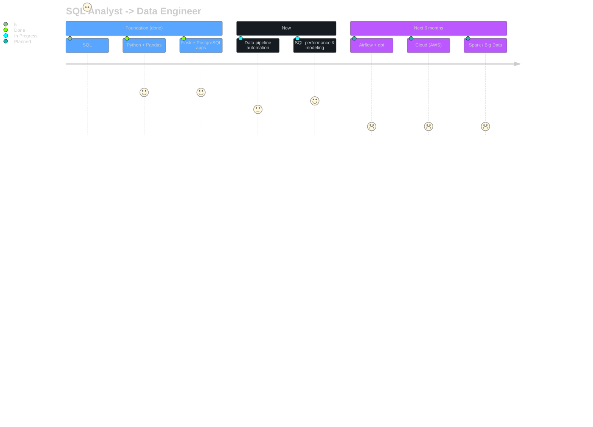

<!-- ═══════════════════════════════════════════════════════════╗
  ║  ROHAN SINGH  ·  DATA → ANALYTICS ENGINEERING             ║
  ╚═══════════════════════════════════════════════════════════╝ -->

<div align="center">


</div>

<br/>

<table align="center">
<tr>
<td width="55%" valign="top">

### 🧬 who i am

I'm a **Junior Product Analyst at Truleague** (Riverhouse Technologies) — a B2B SaaS startup. Day to day I dig through session recordings, run production SQL, and turn messy user behavior into decisions.

Longer term, I'm building toward **Analytics / Data Engineering** — SQL is the on-ramp, pipelines are the destination.

```python
class Rohan:
    def __init__(self):
        self.based_in   = "Bhilai, Chhattisgarh (from Jamshedpur)"
        self.role       = "Junior Product Analyst @ Truleague"
        self.stack_now  = ["SQL", "Python", "Pandas", "Flask", "PostgreSQL"]
        self.building   = "job-app automation w/ Playwright + LLMs"
        self.goal_2027  = "Analytics Engineer -> Data Engineer"

    def status(self):
        return "shipping, querying, upskilling — on repeat"
```

</td>
<td width="45%" valign="top" align="center">


</td>
</tr>
</table>

---

<div align="center">

### 🛠️ current stack


<br/>

`Redash` · `Hotjar` · `Mixpanel` · `UXCam` · `Pandas` · `SQLite`

### 🌱 building toward (next 6 months)


<br/>

`Apache Airflow` · `dbt` · `dimensional modeling` · `Apache Spark` · `CI/CD (GitHub Actions)`

</div>

---

### 🗺️ the roadmap



---

### 📌 things i actually shipped

<table>
<tr>
<td width="50%" valign="top">

**📊 Bug Categorization Dashboard**
Interactive HTML dashboard built on 295 real production bug reports from Truleague (Jun–Jul 2026). Python + pandas end to end.

**🚆 SmartRail** — Top 10, HackIndia 2025
Flask + PostgreSQL + Random Forest model predicting train delays, born out of my own commute frustration.

</td>
<td width="50%" valign="top">

**⚙️ Job-Application Automation**
Playwright + BeautifulSoup scraping, Groq/Gemini for tailoring, SQLite for tracking, scheduled via GitHub Actions.

**🌦️ Weather & AQI Monitor**
Deployed on Render — live environmental data via public APIs.

</td>
</tr>
</table>

---

<div align="center">

### 📈 activity


</div>

---

<!-- SNAKE — KEEP EXACTLY -->
<p align="center">
  
</p>

<div align="center">

### 🌐 connect

<a href="mailto:rohan.sstc@gmail.com"></a>
<a href="https://www.linkedin.com/in/rohan-singh-408549214" target="_blank"></a>
<a href="https://rohan4693.github.io/Portfolio/" target="_blank"></a>

<br/><br/>

<sub><i>"In God we trust. All others must bring data." — W. Edwards Deming</i></sub>
<br/>
<code>Query → Clean → Pipeline → Model → Deploy</code>

</div>


