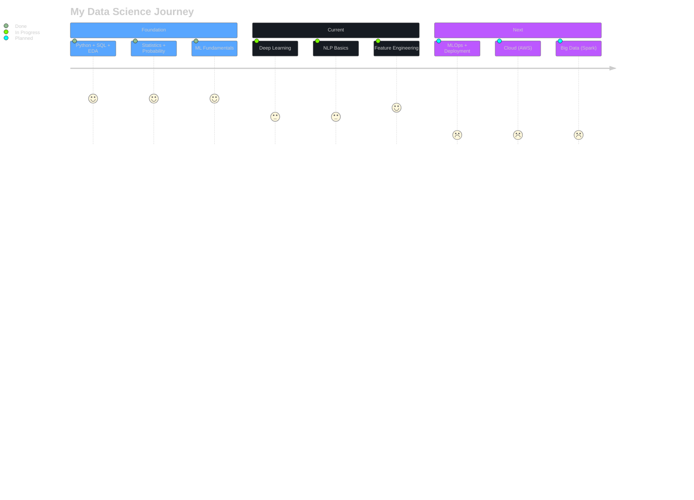

<!-- ═════════════════════════════════════════════════════════════════════╗
  ║  DATA LAB · ROHAN SINGH · CSE (DATA SCIENCE) GRADUATE              ║
  ╚════════════════════════════════════════════════════════════════════╝ -->

<h1 align="center">Rohan Singh</h1>

  

  
  
  
  

 

---

## 🧬 About

> B.Tech in Computer Science & Engineering (Data Science) from **Shri Shankaracharya Technical Campus, Bhilai**. I transform raw data into predictive intelligence — from SQL queries to neural networks. Currently exploring Deep Learning, NLP, and MLOps. Open to Data Analyst & Data Science roles.

---

## ⚡ Quick Facts

- 🔭 Currently working on: **Deep Learning & NLP projects**
- 🌱 Learning: **MLOps · Cloud (AWS) · Big Data**
- 💬 Ask me about: **Python · SQL · Machine Learning · Data Visualization**
- 📫 Reach me at: **rohan.sstc@gmail.com**
- ⚡ Fun fact: **I can spend hours cleaning a dataset and call it "fun"**

---

## 🛠️ Tech Stack

### Languages

  
  
  
  

### Data Science & ML

  
  
  
  
  
  

### Visualization & BI

  
  
  

### Tools

  
  
  
  

---

## 📊 GitHub Analytics

  
  

  

---

## 📈 Activity Graph

  

---

## 🏆 GitHub Trophies

  

---

## 🗂️ Featured Projects

| Project | Stack | What It Does |
|:--------|:------|:-------------|
| [**Carbon Emission Predictor**](https://github.com/rohan4693) | `Python` `Jupyter` `ML` | Predicts carbon emissions using machine learning regression models |
| [**AI Campus Tracker**](https://github.com/rohan4693) | `React` `Node.js` `MongoDB` `Gemini AI` | AI-powered campus issue tracking with smart categorization |
| [**Portfolio Website**](https://rohan4693.github.io/Portfolio/) | `HTML` `CSS` `JavaScript` | Personal brand website showcasing projects & skills |
| [**To-Do App**](https://github.com/rohan4693) | `Python` `Flask` | Full-stack task management with CRUD operations |
| [**CodeAlpha Tasks**](https://github.com/rohan4693) | `Python` | Internship assignments — data analysis & ML pipelines |

---

## 🗺️ Learning Roadmap

---

## 🎓 Education

**B.Tech — Computer Science & Engineering (Data Science)**
📍 Shri Shankaracharya Technical Campus, Bhilai · ✅ Graduated

**DAV Public School**
📍 NIT Campus, Jamshedpur

---

<!-- SNAKE — KEEP EXACTLY -->

  

## 🌐 Connect

  
  
  

   
  <i>"In God we trust. All others must bring data."</i> 
  — W. Edwards Deming

  <code>Collect → Clean → Analyze → Model → Deploy</code>

